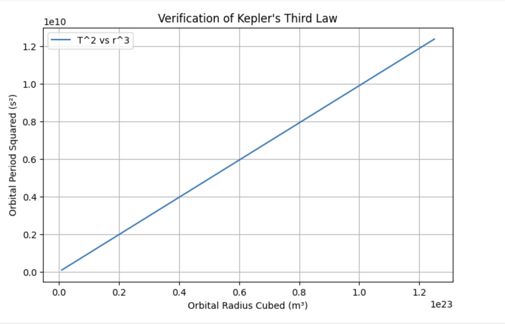

# Problem 1

## Orbital Period and Orbital Radius

### Introduction
Kepler's Third Law states that the square of the orbital period (T) of a planet is proportional to the cube of its orbital radius (r). This relationship is fundamental in celestial mechanics and allows astronomers to determine planetary motions, calculate masses of celestial bodies, and estimate distances in space. The law is derived from Newton's Law of Gravitation and is widely applicable to satellites, planetary systems, and even galaxies.

## Derivation of Kepler's Third Law
For a body in a circular orbit around a central mass \( M \), the gravitational force (\( F_g \)) provides the necessary centripetal force (\( F_c \)) to maintain the orbit:

•⁠  ⁠The gravitational force is given by:

  $$ F_g = \frac{G M m}{r^2} $$

  where:
  - \( G \) is the gravitational constant,
  - \( M \) is the mass of the central body,
  - \( m \) is the mass of the orbiting object,
  - \( r \) is the orbital radius.

•⁠  ⁠The centripetal force required to maintain the orbit is given by:

  $$ F_c = \frac{m v^2}{r} $$

  where:
  - \( v \) is the orbital velocity of the body.

Setting the gravitational force equal to the centripetal force:

$$ \frac{G M m}{r^2} = \frac{m v^2}{r} $$

Canceling \( m \) from both sides and solving for \( v^2 \):

$$ v^2 = \frac{G M}{r} $$

Now, the orbital period \( T \), which is the time it takes for the body to complete one full orbit, is related to the orbital velocity by:

$$ T = \frac{2\pi r}{v} $$

Substitute the expression for \( v \):

$$ T = \frac{2\pi r}{\sqrt{\frac{G M}{r}}} $$

Simplifying the equation:

$$ T = 2\pi \sqrt{\frac{r^3}{G M}} $$

Squaring both sides to eliminate the square root:

$$ T^2 = \frac{4\pi^2 r^3}{G M} $$

This final equation confirms the fundamental relationship:

$$ T^2 \propto r^3 $$

This result means that if you plot \( T^2 \) versus \( r^3 \) for any orbiting object, the graph will produce a straight line, and the proportionality constant depends on the mass of the central body.

### Implementation
A Python script can be used to verify this relationship by simulating circular orbits and plotting \( T^2 \) vs. \( r^3 \).
```python
# Parameters
M = 5.972e24  # Mass of Earth (kg)
radii = np.linspace(1e7, 5e7, 100)  # Orbital radii in meters
T_values = orbital_period(radii, M)

# Squaring period and cubing radius
T_squared = T_values**2
r_cubed = radii**3

# Plot results
plt.figure(figsize=(8, 5))
plt.plot(r_cubed, T_squared, label='T^2 vs r^3')
plt.xlabel("Orbital Radius Cubed (m³)")
plt.ylabel("Orbital Period Squared (s²)")
plt.title("Verification of Kepler's Third Law")
plt.legend()
plt.grid()
plt.show()


import numpy as np
import matplotlib.pyplot as plt

def orbital_period(radius, M, G=6.674e-11):
    return 2 * np.pi * np.sqrt(radius**3 / (G * M))

# Parameters
M = 5.972e24  # Mass of Earth (kg)
radii = np.linspace(1e7, 5e7, 100)  # Orbital radii in meters
T_values = orbital_period(radii, M)

# Squaring period and cubing radius
T_squared = T_values**2
r_cubed = radii**3

# Plot results
plt.figure(figsize=(8, 5))
plt.plot(r_cubed, T_squared, label='T^2 vs r^3')
plt.xlabel("Orbital Radius Cubed (m³)")
plt.ylabel("Orbital Period Squared (s²)")
plt.title("Verification of Kepler's Third Law")
plt.legend()
plt.grid()
plt.show()
```
*Graphical verification of Kepler's Third Law*

