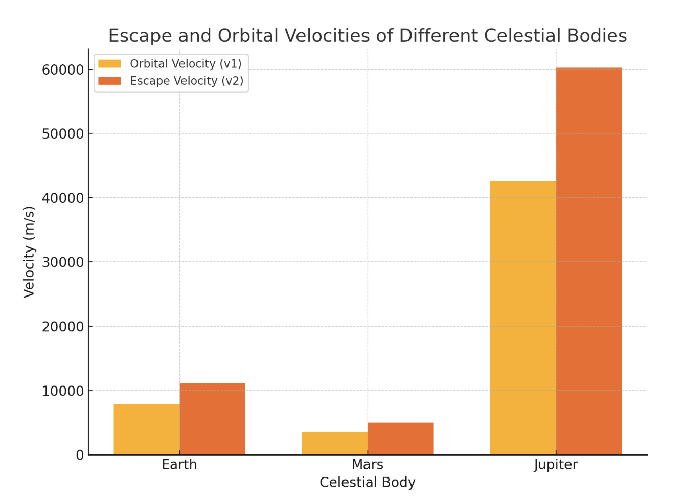

# Problem 2

## Escape Velocities and Cosmic Velocities

### Introduction
The concept of escape velocity is essential for understanding the conditions necessary to leave a celestial body's gravitational influence. Beyond this, the first, second, and third cosmic velocities are crucial for space exploration, determining the thresholds for orbiting, escaping, and leaving a star system. These principles are vital for satellite launches, interplanetary missions, and potential interstellar travel.

### Theory

1.⁠ ⁠*First Cosmic Velocity*:  
   The first cosmic velocity is the minimum speed needed for an object to enter a stable orbit around a celestial body. This velocity depends on the mass of the body and the radius of the orbit. The formula is derived from the balance between gravitational force and centripetal force for a circular orbit:

   $$
   v_1 = \sqrt{\frac{GM}{R}}
   $$

   where:
   - \( G \) is the gravitational constant,
   - \( M \) is the mass of the celestial body,
   - \( R \) is the radius of the orbit.

2.⁠ ⁠*Second Cosmic Velocity*:  
   The second cosmic velocity is the escape velocity, the speed required to escape the gravitational influence of a celestial body. It is derived by equating kinetic and potential energy:

   $$
   v_2 = \sqrt{\frac{2GM}{R}}
   $$

   where:
   - \( G \), \( M \), and \( R \) have the same definitions as in the first cosmic velocity.

3.⁠ ⁠*Third Cosmic Velocity*:  
   The third cosmic velocity is the speed required for an object to escape the gravitational pull of a star system. It takes into account the gravitational influences of both the planet and the star:

   $$
   v_3 = \sqrt{\frac{2GM_{\text{star}}}{R_{\text{star}}} + \frac{2GM_{\text{planet}}}{R_{\text{planet}}}}
   $$

### Mathematical Derivations
•⁠  ⁠The escape velocity is derived from energy conservation principles. The total mechanical energy at the surface of the celestial body (kinetic plus potential energy) must equal zero for the object to escape:

  $$
  \frac{1}{2}mv^2 = \frac{GMm}{R}
  $$

  This simplifies to the formula for escape velocity:

  $$
  v_2 = \sqrt{\frac{2GM}{R}}
  $$

### Calculations for Different Celestial Bodies

#### Constants:
•⁠  ⁠*Gravitational constant* (\( G \)) = \( 6.67430 \times 10^{-11} \, \text{m}^3 \, \text{kg}^{-1} \, \text{s}^{-2} \)
•⁠  ⁠*Earth*:
  - Mass (\( M_{\text{Earth}} \)) = \( 5.972 \times 10^{24} \, \text{kg} \)
  - Radius (\( R_{\text{Earth}} \)) = \( 6.371 \times 10^6 \, \text{m} \)
•⁠  ⁠*Mars*:
  - Mass (\( M_{\text{Mars}} \)) = \( 0.64171 \times 10^{24} \, \text{kg} \)
  - Radius (\( R_{\text{Mars}} \)) = \( 3.396 \times 10^6 \, \text{m} \)
•⁠  ⁠*Jupiter*:
  - Mass (\( M_{\text{Jupiter}} \)) = \( 1.898 \times 10^{27} \, \text{kg} \)
  - Radius (\( R_{\text{Jupiter}} \)) = \( 6.991 \times 10^7 \, \text{m} \)

### Python Implementation
The following Python script calculates the first and second cosmic velocities for Earth, Mars, and Jupiter:

```python
import numpy as np
import matplotlib.pyplot as plt

# Constants
G = 6.67430e-11  # gravitational constant in m^3 kg^-1 s^-2

# Celestial body parameters (Mass in kg, Radius in m)
celestial_bodies = {
    "Earth": {"mass": 5.972e24, "radius": 6.371e6},
    "Mars": {"mass": 0.64171e24, "radius": 3.396e6},
    "Jupiter": {"mass": 1.898e27, "radius": 6.991e7}
}

# Calculate escape velocities (v_2) and orbital velocities (v_1)
def calculate_velocities(mass, radius):
    v1 = np.sqrt(G * mass / radius)
    v2 = np.sqrt(2 * G * mass / radius)
    return v1, v2

# Calculate velocities for each celestial body
velocities = {}
for body, params in celestial_bodies.items():
    v1, v2 = calculate_velocities(params["mass"], params["radius"])
    velocities[body] = {"v1": v1, "v2": v2}

# Plotting the velocities
labels = list(velocities.keys())
v1_values = [velocities[body]["v1"] for body in labels]
v2_values = [velocities[body]["v2"] for body in labels]

x = np.arange(len(labels))

fig, ax = plt.subplots(figsize=(8, 6))
bar_width = 0.35
ax.bar(x - bar_width/2, v1_values, bar_width, label='Orbital Velocity (v1)')
ax.bar(x + bar_width/2, v2_values, bar_width, label='Escape Velocity (v2)')

ax.set_xlabel('Celestial Body')
ax.set_ylabel('Velocity (m/s)')
ax.set_title('Escape and Orbital Velocities of Different Celestial Bodies')
ax.set_xticks(x)
ax.set_xticklabels(labels)
ax.legend()

plt.tight_layout()
plt.show()
```

**Graphical representation of orbital and escape velocities for Earth, Mars, and Jupiter**


