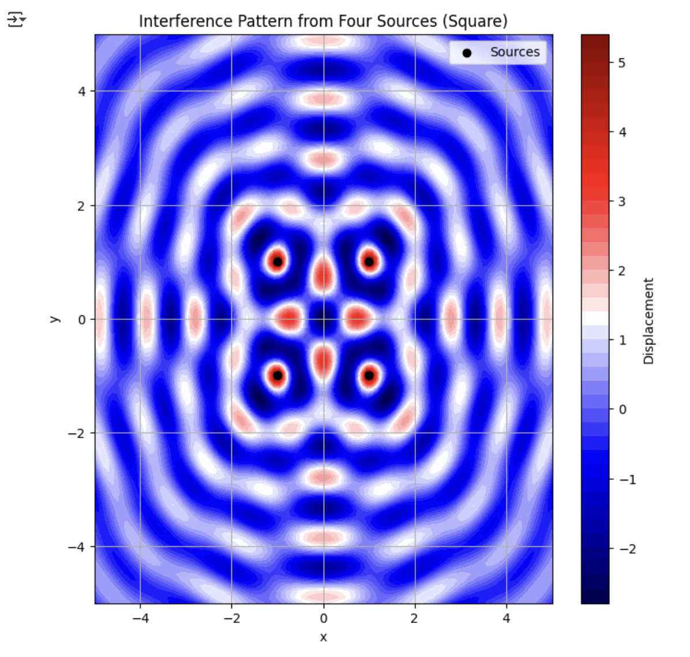
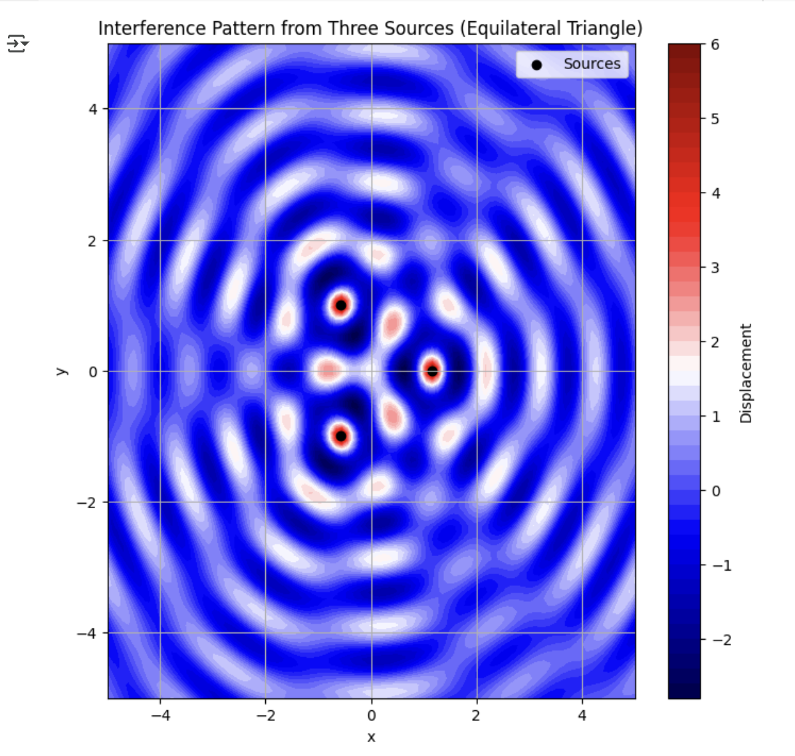

# Problem 1
# Interference Patterns on a Water Surface

## Problem Statement

We need to analyze the interference patterns formed on a water surface due to the superposition of circular waves emitted from point sources placed at the vertices of a regular polygon. The wave equation for a single source is given as:

\[
\eta(x, y, t) = \frac{A}{\sqrt{r}} \cdot \cos(kr - \omega t + \phi)
\]

where:

- \(\eta(x, y, t)\) is the displacement of the water surface at point \((x, y)\) and time \(t\),
- \(A\) is the amplitude of the wave,
- \(k = \frac{2\pi}{\lambda}\) is the wave number, related to the wavelength \(\lambda\),
- \(\omega = 2\pi f\) is the angular frequency, related to the frequency \(f\),
- \(r = \sqrt{(x - x_0)^2 + (y - y_0)^2}\) is the distance from the source at \((x_0, y_0)\) to the point \((x, y)\),
- \(\phi\) is the initial phase.

Our task involves:

1. Selecting a regular polygon and placing wave sources at its vertices.
2. Writing the wave equations for each source.
3. Applying the principle of superposition to sum the displacements.
4. Analyzing the resulting interference patterns.
5. Visualizing the patterns graphically.

---
# Variant A - Square as a Regular Polygon

## Step 1: Select a Regular Polygon

Let’s choose a **square** as our regular polygon. A square has 4 vertices, so we will have \(N = 4\) point sources. We’ll place the square in the \(xy\)-plane, centered at the origin \((0, 0)\), with a side length of \(2a\). For simplicity, let’s set \(a = 1\), so the side length is 2 units.

The vertices of the square are:

- Vertex 1: \((1, 1)\)
- Vertex 2: \((1, -1)\)
- Vertex 3: \((-1, -1)\)
- Vertex 4: \((-1, 1)\)

Each vertex will be a point source emitting circular waves.

---

## Step 2: Position the Sources

The positions of the sources are:

- Source 1: \((x_1, y_1) = (1, 1)\)
- Source 2: \((x_2, y_2) = (1, -1)\)
- Source 3: \((x_3, y_3) = (-1, -1)\)
- Source 4: \((x_4, y_4) = (-1, 1)\)

---

## Step 3: Wave Equations

Each source emits a wave of the form:

\[
\eta_i(x, y, t) = \frac{A}{\sqrt{r_i}} \cdot \cos(k r_i - \omega t + \phi_i)
\]

where \(r_i = \sqrt{(x - x_i)^2 + (y - y_i)^2}\) is the distance from the \(i\)-th source to the point \((x, y)\).

### Assumptions:

- All sources have the same amplitude \(A\).
- All sources have the same wavelength \(\lambda\) and frequency \(f\), so \(k = \frac{2\pi}{\lambda}\) and \(\omega = 2\pi f\) are the same for all sources.
- The waves are coherent, meaning the phase difference between sources is constant. For simplicity, let’s assume the initial phase \(\phi_i = 0\) for all sources (i.e., all sources are in phase).

Let’s set some numerical values for the parameters:

- Amplitude \(A = 1\),
- Wavelength \(\lambda = 1\), so \(k = \frac{2\pi}{\lambda} = 2\pi\),
- Frequency \(f = 1\), so \(\omega = 2\pi f = 2\pi\),
- Initial phase \(\phi_i = 0\).

Thus, the wave equation for the \(i\)-th source becomes:

\[
\eta_i(x, y, t) = \frac{1}{\sqrt{r_i}} \cdot \cos(2\pi r_i - 2\pi t)
\]

where:

- \(r_1 = \sqrt{(x - 1)^2 + (y - 1)^2}\),
- \(r_2 = \sqrt{(x - 1)^2 + (y + 1)^2}\),
- \(r_3 = \sqrt{(x + 1)^2 + (y + 1)^2}\),
- \(r_4 = \sqrt{(x + 1)^2 + (y - 1)^2}\).

---

## Step 4: Superposition of Waves

The total displacement at a point \((x, y)\) at time \(t\) is the sum of the displacements from all sources:

\[
\eta(x, y, t) = \sum_{i=1}^{N} \eta_i(x, y, t)
\]

For our square with 4 sources:

\[
\eta(x, y, t) = \eta_1 + \eta_2 + \eta_3 + \eta_4
\]

\[
\eta(x, y, t) = \sum_{i=1}^{4} \frac{1}{\sqrt{r_i}} \cdot \cos(2\pi r_i - 2\pi t)
\]

---

## Step 5: Analyze Interference Patterns

To analyze the interference patterns, we need to compute \(\eta(x, y, t)\) over a grid of points \((x, y)\) at a specific time \(t\). Let’s fix \(t = 0\) for simplicity, so the equation becomes:

\[
\eta(x, y, 0) = \sum_{i=1}^{4} \frac{1}{\sqrt{r_i}} \cdot \cos(2\pi r_i)
\]

### Constructive Interference:

Constructive interference occurs when the waves from different sources are in phase, i.e., when the phase difference \(k(r_i - r_j)\) between any two sources is an integer multiple of \(2\pi\). This happens when:

\[
|r_i - r_j| = m \lambda \quad (m = 0, 1, 2, \dots)
\]

Since \(\lambda = 1\), constructive interference occurs when the path difference \(|r_i - r_j|\) is an integer.

### Destructive Interference:

Destructive interference occurs when the waves are out of phase by \(\pi\) radians, i.e., when:

\[
|r_i - r_j| = \left(m + \frac{1}{2}\right) \lambda \quad (m = 0, 1, 2, \dots)
\]

For \(\lambda = 1\), this happens when the path difference is a half-integer (e.g., 0.5, 1.5, 2.5, ...).

We’ll visualize the total displacement \(\eta(x, y, 0)\) to identify these regions.

---

## Step 6: Visualization

Below is a Python script that computes and visualizes the interference pattern using NumPy and Matplotlib. The script creates a 2D grid of points, calculates the total displacement, and plots the result as a heatmap.

```python
import numpy as np
import matplotlib.pyplot as plt

# Parameters
A = 1.0  # Amplitude
lambda_ = 1.0  # Wavelength
k = 2 * np.pi / lambda_  # Wave number
t = 0.0  # Time (fixed at t=0 for visualization)

# Define the positions of the sources (vertices of a square)
sources = [
    (1, 1),   # Source 1
    (1, -1),  # Source 2
    (-1, -1), # Source 3
    (-1, 1)   # Source 4
]

# Create a grid of points
x = np.linspace(-5, 5, 100)  # x-range
y = np.linspace(-5, 5, 100)  # y-range
X, Y = np.meshgrid(x, y)

# Initialize the total displacement
eta = np.zeros_like(X)

# Sum the contributions from each source
for (x0, y0) in sources:
    # Distance from the source to each point on the grid
    r = np.sqrt((X - x0)**2 + (Y - y0)**2)
    # Avoid division by zero at the source
    r = np.where(r < 1e-6, 1e-6, r)
    # Wave contribution from this source
    eta += (A / np.sqrt(r)) * np.cos(k * r)

# Plot the interference pattern
plt.figure(figsize=(8, 8))
plt.contourf(X, Y, eta, cmap='seismic', levels=50)
plt.colorbar(label='Displacement')
plt.scatter([s[0] for s in sources], [s[1] for s in sources], c='black', marker='o', label='Sources')
plt.title('Interference Pattern from Four Sources (Square)')
plt.xlabel('x')
plt.ylabel('y')
plt.legend()
plt.grid(True)
plt.show()
```

# Visualization of the script

- **Plot:** Interference Pattern:


## Explanation of the Code

- **Parameters**: We define the amplitude \(A\), wavelength \(\lambda\), wave number \(k\), and time \(t\).
- **Sources**: The positions of the four sources are defined as the vertices of the square.
- **Grid**: A 2D grid of points \((x, y)\) is created using `np.meshgrid` over the range \([-5, 5] \times [-5, 5]\).
- **Displacement Calculation**: For each source, we compute the distance \(r_i\) to every point on the grid, then add the wave contribution \(\frac{A}{\sqrt{r_i}} \cos(k r_i)\) to the total displacement.
- **Visualization**: The total displacement is plotted as a heatmap using `plt.contourf`. The `seismic` colormap highlights positive (red) and negative (blue) displacements, making it easy to see constructive and destructive interference. The sources are marked with black dots.

---

## Step 7: Interpretation of Results

When you run the script, you’ll see a heatmap showing the interference pattern. Here’s what to look for:

- **Constructive Interference**: Regions where the displacement is large (bright red or blue) indicate constructive interference, where the waves from multiple sources add up in phase.
- **Destructive Interference**: Regions where the displacement is near zero (white) indicate destructive interference, where the waves cancel each other out.
- **Symmetry**: Since the sources are at the vertices of a square, the interference pattern will exhibit four-fold symmetry. You’ll notice repeating patterns along the axes and diagonals.

### Observations:

- Near the sources, the waves are strong (large displacement) because of the \(1/\sqrt{r}\) term.
- Along the lines connecting pairs of sources (e.g., \((1, 1)\) to \((1, -1)\)), you’ll see alternating regions of constructive and destructive interference due to the changing path difference.
- At the center \((0, 0)\), the distances from all four sources are equal (\(r = \sqrt{2}\)), so the waves arrive with the same phase, leading to constructive interference.


# Variant B - Equilateral Triangle as a Regular Polygon

## Step 1: Select a Regular Polygon

Let’s choose an **equilateral triangle** as our regular polygon. An equilateral triangle has 3 vertices, so we will have \(N = 3\) point sources. We’ll place the triangle in the \(xy\)-plane, centered at the origin \((0, 0)\), with a side length of \(s\). For simplicity, let’s set \(s = 2\).

To find the coordinates of the vertices of an equilateral triangle centered at the origin:

- The distance from the center to each vertex (circumradius) of an equilateral triangle with side length \(s\) is given by \(R = \frac{s}{\sqrt{3}}\).
- For \(s = 2\), the circumradius is \(R = \frac{2}{\sqrt{3}} \approx 1.1547\).

The vertices of the equilateral triangle, with the first vertex at angle \(0^\circ\) (along the positive \(x\)-axis), are:

- Vertex 1: \((R, 0) = \left(\frac{2}{\sqrt{3}}, 0\right) \approx (1.1547, 0)\),
- Vertex 2: \((R \cos 120^\circ, R \sin 120^\circ) = \left(-\frac{R}{2}, R \frac{\sqrt{3}}{2}\right) = \left(-\frac{1}{\sqrt{3}}, \frac{\sqrt{3}}{\sqrt{3}}\right) = \left(-\frac{1}{\sqrt{3}}, 1\right) \approx (-0.5774, 1)\),
- Vertex 3: \((R \cos 240^\circ, R \sin 240^\circ) = \left(-\frac{R}{2}, -R \frac{\sqrt{3}}{2}\right) = \left(-\frac{1}{\sqrt{3}}, -1\right) \approx (-0.5774, -1)\).

Each vertex will be a point source emitting circular waves.

---

## Step 2: Position the Sources

The positions of the sources are:

- Source 1: \((x_1, y_1) = \left(\frac{2}{\sqrt{3}}, 0\right) \approx (1.1547, 0)\),
- Source 2: \((x_2, y_2) = \left(-\frac{1}{\sqrt{3}}, 1\right) \approx (-0.5774, 1)\),
- Source 3: \((x_3, y_3) = \left(-\frac{1}{\sqrt{3}}, -1\right) \approx (-0.5774, -1)\).

---

## Step 3: Wave Equations

Each source emits a wave of the form:

\[
\eta_i(x, y, t) = \frac{A}{\sqrt{r_i}} \cdot \cos(k r_i - \omega t + \phi_i)
\]

where \(r_i = \sqrt{(x - x_i)^2 + (y - y_i)^2}\) is the distance from the \(i\)-th source to the point \((x, y)\).

### Assumptions:

- All sources have the same amplitude \(A\).
- All sources have the same wavelength \(\lambda\) and frequency \(f\), so \(k = \frac{2\pi}{\lambda}\) and \(\omega = 2\pi f\) are the same for all sources.
- The waves are coherent, meaning the phase difference between sources is constant. For simplicity, let’s assume the initial phase \(\phi_i = 0\) for all sources (i.e., all sources are in phase).

Let’s set the same numerical values for the parameters as before:

- Amplitude \(A = 1\),
- Wavelength \(\lambda = 1\), so \(k = \frac{2\pi}{\lambda} = 2\pi\),
- Frequency \(f = 1\), so \(\omega = 2\pi f = 2\pi\),
- Initial phase \(\phi_i = 0\).

Thus, the wave equation for the \(i\)-th source becomes:

\[
\eta_i(x, y, t) = \frac{1}{\sqrt{r_i}} \cdot \cos(2\pi r_i - 2\pi t)
\]

where:

- \(r_1 = \sqrt{\left(x - \frac{2}{\sqrt{3}}\right)^2 + (y - 0)^2}\),
- \(r_2 = \sqrt{\left(x + \frac{1}{\sqrt{3}}\right)^2 + (y - 1)^2}\),
- \(r_3 = \sqrt{\left(x + \frac{1}{\sqrt{3}}\right)^2 + (y + 1)^2}\).

---

## Step 4: Superposition of Waves

The total displacement at a point \((x, y)\) at time \(t\) is the sum of the displacements from all sources:

\[
\eta(x, y, t) = \sum_{i=1}^{N} \eta_i(x, y, t)
\]

For our equilateral triangle with 3 sources:

\[
\eta(x, y, t) = \eta_1 + \eta_2 + \eta_3
\]

\[
\eta(x, y, t) = \sum_{i=1}^{3} \frac{1}{\sqrt{r_i}} \cdot \cos(2\pi r_i - 2\pi t)
\]

---

## Step 5: Analyze Interference Patterns

To analyze the interference patterns, we compute \(\eta(x, y, t)\) over a grid of points \((x, y)\) at a specific time \(t\). Let’s fix \(t = 0\) for simplicity, so the equation becomes:

\[
\eta(x, y, 0) = \sum_{i=1}^{3} \frac{1}{\sqrt{r_i}} \cdot \cos(2\pi r_i)
\]

### Constructive Interference:

Constructive interference occurs when the waves from different sources are in phase, i.e., when the phase difference \(k(r_i - r_j)\) between any two sources is an integer multiple of \(2\pi\):

\[
|r_i - r_j| = m \lambda \quad (m = 0, 1, 2, \dots)
\]

Since \(\lambda = 1\), constructive interference occurs when the path difference \(|r_i - r_j|\) is an integer.

### Destructive Interference:

Destructive interference occurs when the waves are out of phase by \(\pi\) radians, i.e., when:

\[
|r_i - r_j| = \left(m + \frac{1}{2}\right) \lambda \quad (m = 0, 1, 2, \dots)
\]

For \(\lambda = 1\), this happens when the path difference is a half-integer (e.g., 0.5, 1.5, 2.5, ...).

We’ll visualize the total displacement \(\eta(x, y, 0)\) to identify these regions.

---

## Step 6: Visualization

Below is a Python script that computes and visualizes the interference pattern using NumPy and Matplotlib. The script creates a 2D grid of points, calculates the total displacement, and plots the result as a heatmap.

```python
import numpy as np
import matplotlib.pyplot as plt

# Parameters
A = 1.0  # Amplitude
lambda_ = 1.0  # Wavelength
k = 2 * np.pi / lambda_  # Wave number
t = 0.0  # Time (fixed at t=0 for visualization)

# Define the positions of the sources (vertices of an equilateral triangle)
R = 2 / np.sqrt(3)  # Circumradius of the triangle with side length 2
sources = [
    (R, 0),               # Source 1
    (-R/2, R * np.sqrt(3)/2),  # Source 2
    (-R/2, -R * np.sqrt(3)/2)  # Source 3
]

# Create a grid of points
x = np.linspace(-5, 5, 100)  # x-range
y = np.linspace(-5, 5, 100)  # y-range
X, Y = np.meshgrid(x, y)

# Initialize the total displacement
eta = np.zeros_like(X)

# Sum the contributions from each source
for (x0, y0) in sources:
    # Distance from the source to each point on the grid
    r = np.sqrt((X - x0)**2 + (Y - y0)**2)
    # Avoid division by zero at the source
    r = np.where(r < 1e-6, 1e-6, r)
    # Wave contribution from this source
    eta += (A / np.sqrt(r)) * np.cos(k * r)

# Plot the interference pattern
plt.figure(figsize=(8, 8))
plt.contourf(X, Y, eta, cmap='seismic', levels=50)
plt.colorbar(label='Displacement')
plt.scatter([s[0] for s in sources], [s[1] for s in sources], c='black', marker='o', label='Sources')
plt.title('Interference Pattern from Three Sources (Equilateral Triangle)')
plt.xlabel('x')
plt.ylabel('y')
plt.legend()
plt.grid(True)
plt.show()
```
# Visualization of the script

- **Plot:** Interference Pattern:


## Explanation of the Code

- **Parameters**: We define the amplitude \(A\), wavelength \(\lambda\), wave number \(k\), and time \(t\).
- **Sources**: The positions of the three sources are defined as the vertices of the equilateral triangle, calculated using the circumradius \(R\).
- **Grid**: A 2D grid of points \((x, y)\) is created using `np.meshgrid` over the range \([-5, 5] \times [-5, 5]\).
- **Displacement Calculation**: For each source, we compute the distance \(r_i\) to every point on the grid, then add the wave contribution \(\frac{A}{\sqrt{r_i}} \cos(k r_i)\) to the total displacement.
- **Visualization**: The total displacement is plotted as a heatmap using `plt.contourf`. The `seismic` colormap highlights positive (red) and negative (blue) displacements, making it easy to see constructive and destructive interference. The sources are marked with black dots.

---

## Step 7: Interpretation of Results

When you run the script, you’ll see a heatmap showing the interference pattern. Here’s what to look for:

- **Constructive Interference**: Regions where the displacement is large (bright red or blue) indicate constructive interference, where the waves from multiple sources add up in phase.
- **Destructive Interference**: Regions where the displacement is near zero (white) indicate destructive interference, where the waves cancel each other out.
- **Symmetry**: Since the sources are at the vertices of an equilateral triangle, the interference pattern will exhibit three-fold symmetry. You’ll notice repeating patterns along the directions of the triangle’s axes of symmetry (at \(0^\circ\), \(120^\circ\), and \(240^\circ\)).

### Observations:

- Near the sources, the waves are strong (large displacement) because of the \(1/\sqrt{r}\) term.
- Along the lines connecting pairs of sources (e.g., from \((R, 0)\) to \(\left(-\frac{R}{2}, R \frac{\sqrt{3}}{2}\right)\)), you’ll see alternating regions of constructive and destructive interference due to the changing path difference.
- At the center \((0, 0)\), the distances from all three sources are equal (\(r = R = \frac{2}{\sqrt{3}}\)), so the waves arrive with the same phase, leading to constructive interference.
