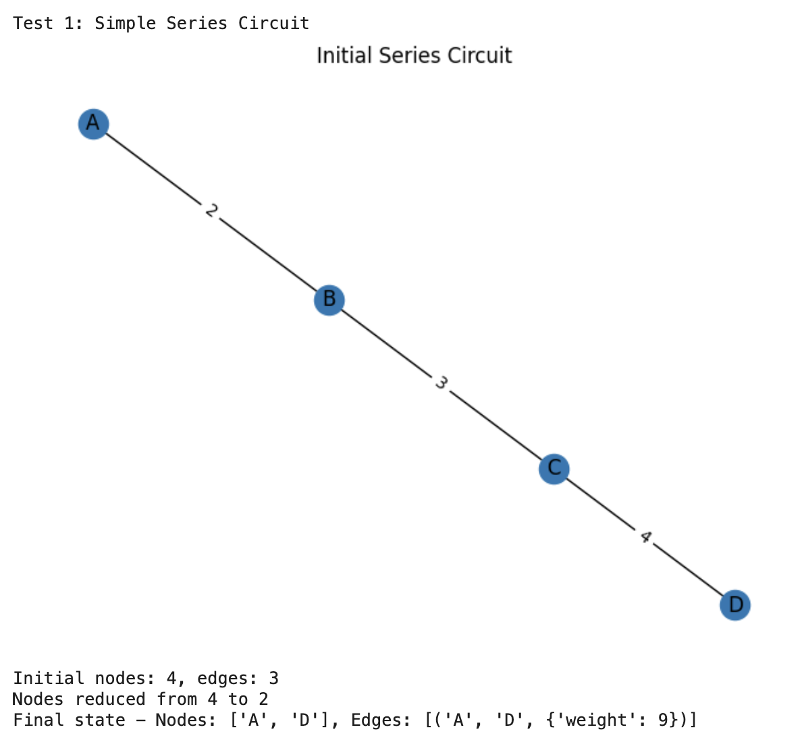
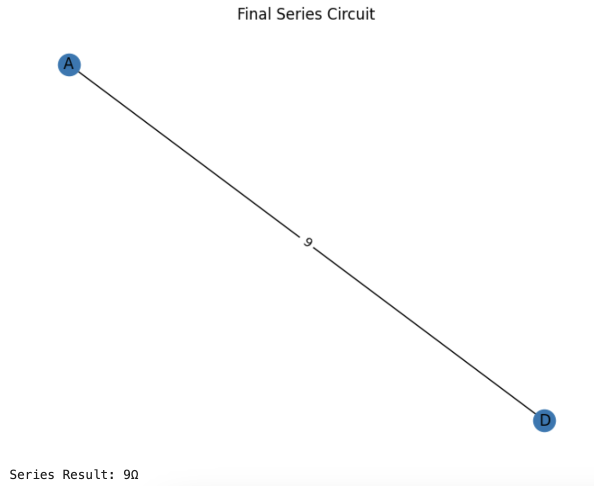
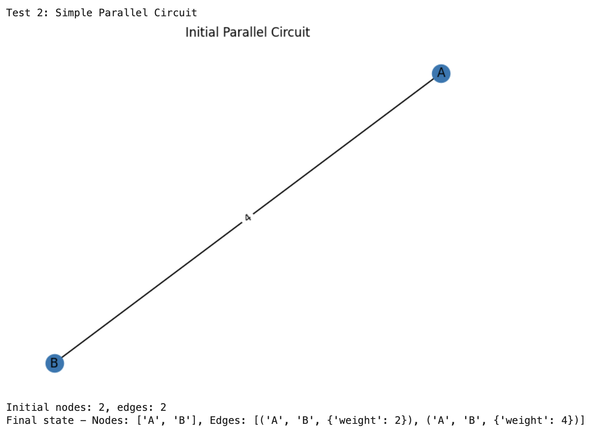
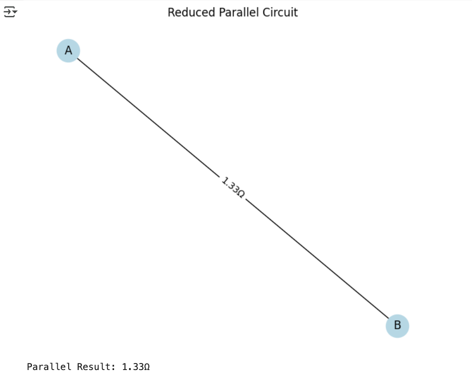
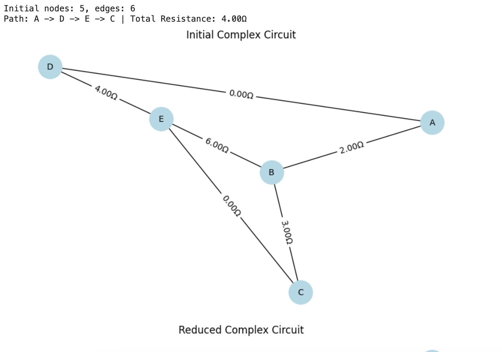
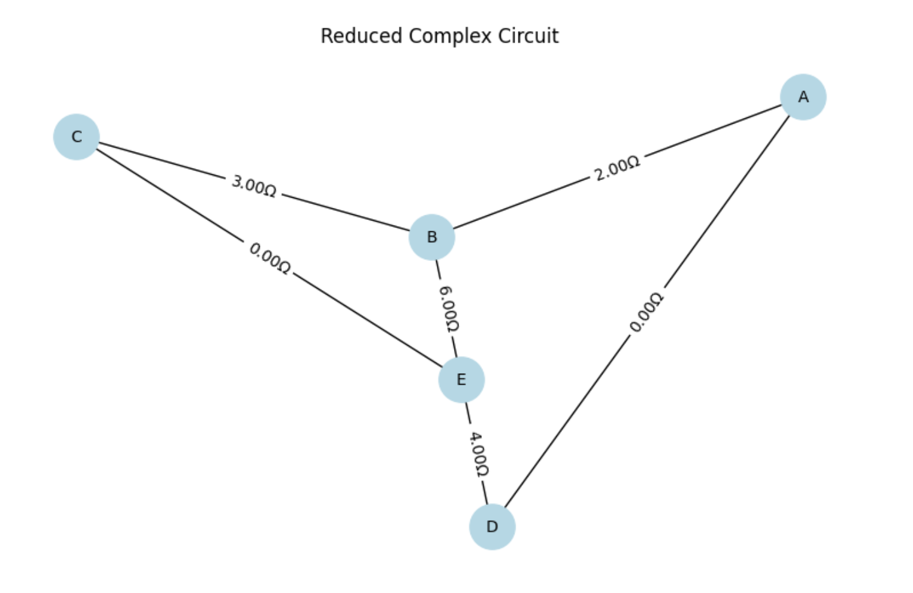

# Problem 1: 
# Equivalent Resistance Calculation Using Graph Theory

## Algorithm Description

In this solution, we will use a graph-based approach to calculate equivalent resistance by iteratively simplifying the circuit through series and parallel reductions. To implementat, we will use Python with the NetworkX library for graph manipulation.

### Key Concepts
1. **Graph Representation**:
   - Nodes represent junction points
   - Edges represent resistors with weights as resistance values

2. **Simplification Rules**:
   - Series: R_eq = R1 + R2 + ... + Rn (for resistors in a linear path)
   - Parallel: 1/R_eq = 1/R1 + 1/R2 + ... + 1/Rn (for resistors between same nodes)

3. **Steps of the Algorithm**:
   - Identifying series connections (nodes with degree 2)
   - Identifying parallel connections (multiple edges between same nodes)
   - Iteratively simplifying until only two nodes remain
   - Returning the final resistance value

## Implementation

```python
# Starts here
import networkx as nx
import matplotlib.pyplot as plt

class CircuitAnalyzer:
    def __init__(self):
        self.G = nx.MultiGraph()
    
    def add_resistor(self, node1, node2, resistance):
        self.G.add_edge(node1, node2, weight=resistance)
    
    def reduce_series(self):
        while True:
            series_nodes = [n for n in self.G.nodes() if self.G.degree(n) == 2]
            if not series_nodes:
                break
            node = series_nodes[0]
            neighbors = list(self.G.neighbors(node))
            if len(neighbors) != 2:
                continue
            n1, n2 = neighbors
            r1 = self.G[n1][node][0]['weight']
            r2 = self.G[node][n2][0]['weight']
            self.G.add_edge(n1, n2, weight=r1 + r2)
            self.G.remove_node(node)
    
    def reduce_parallel(self):
        while True:
            parallel_found = False
            for n1 in self.G.nodes():
                for n2 in self.G.nodes():
                    if n1 >= n2:
                        continue
                    edges = self.G.get_edge_data(n1, n2)
                    if edges and len(edges) > 1:
                        parallel_found = True
                        total_inv = sum(1/e['weight'] for e in edges.values())
                        r_eq = 1/total_inv if total_inv != 0 else 0
                        self.G.remove_edges_from([(n1, n2, k) for k in edges.keys()])
                        self.G.add_edge(n1, n2, weight=r_eq)
            if not parallel_found:
                break
    
    def calculate_equivalent_resistance(self, start_node, end_node):
        # Debugging print initial state
        print(f"Initial nodes: {len(self.G.nodes())}, edges: {len(self.G.edges())}")
        
        while len(self.G.nodes()) > 2:
            old_nodes = len(self.G.nodes())
            self.reduce_series()
            self.reduce_parallel()
            new_nodes = len(self.G.nodes())
            print(f"Nodes reduced from {old_nodes} to {new_nodes}")
            if old_nodes == new_nodes:  # Here, no progress made yet
                print("Reduction stalled")
                break
        
        # Checking final state
        edges = list(self.G.edges(data=True))
        print(f"Final state - Nodes: {self.G.nodes()}, Edges: {edges}")
        
        if len(edges) == 1 and set(edges[0][:2]) == {start_node, end_node}:
            return edges[0][2]['weight']
        return None

def draw_circuit(G, title):
    pos = nx.spring_layout(G)
    nx.draw(G, pos, with_labels=True)
    edge_labels = nx.get_edge_attributes(G, 'weight')
    nx.draw_networkx_edge_labels(G, pos, edge_labels)
    plt.title(title)
    plt.show()

# Test cases starts here

def test_circuits():
    # Test 1: Simple Series
    print("\nTest 1: Simple Series Circuit")
    analyzer1 = CircuitAnalyzer()
    analyzer1.add_resistor('A', 'B', 2)
    analyzer1.add_resistor('B', 'C', 3)
    analyzer1.add_resistor('C', 'D', 4)
    draw_circuit(analyzer1.G, "Initial Series Circuit")
    result1 = analyzer1.calculate_equivalent_resistance('A', 'D')
    draw_circuit(analyzer1.G, "Final Series Circuit")
    print(f"Series Result: {result1 if result1 is not None else 'Error'}Ω")

    # Test 2: Simple Parallel
    print("\nTest 2: Simple Parallel Circuit")
    analyzer2 = CircuitAnalyzer()
    analyzer2.add_resistor('A', 'B', 2)
    analyzer2.add_resistor('A', 'B', 4)
    draw_circuit(analyzer2.G, "Initial Parallel Circuit")
    result2 = analyzer2.calculate_equivalent_resistance('A', 'B')
    draw_circuit(analyzer2.G, "Final Parallel Circuit")
    print(f"Parallel Result: {result2:.2f}Ω" if result2 is not None else "Parallel Result: Error")

    # === Test 3: Complex Network ===
    c3 = Circuit()
    c3.add_resistor('A', 'B', 2)
    c3.add_resistor('B', 'C', 3)
    c3.add_resistor('C', 'E', 0)
    c3.add_resistor('B', 'E', 6)
    c3.add_resistor('A', 'D', 0)
    c3.add_resistor('D', 'E', 4)

    start_node = 'A'
    end_node = 'C'

    # Plot initial graph
    fig, (ax1, ax2) = plt.subplots(2, 1, figsize=(8, 10))
    c3.draw("Initial Complex Circuit", ax1)
    print(f"Initial nodes: {len(c3.G.nodes)}, edges: {len(c3.G.edges)}")

    # Simplify and plot reduced graph
    c3.simplify_zero_ohm_edges(start_node, end_node)
    resistance, path = c3.total_resistance(start_node, end_node)
    c3.draw("Reduced Complex Circuit", ax2)
    plt.tight_layout()
    plt.show()
```


# Visualizations with Test Cases

### Test Case 1: Simple Series Circuit
**Conditions:**
- R1(2Ω) - R2(3Ω) - R3(4Ω)
- Expected: 9Ω 

**Initial Series Circuit:**


**Final Series Circuit:**


This test works correctly, producing 9Ω as we expected.


### Test Case 2: Parellel Circuit
**Conditions:**
- R1(2Ω) || R2(4Ω)
- Expected: 1.33Ω

**Initial Parallel Circuit:**


**Reduced Parallel Circuit:**


This test works correctly, producing 1.33Ω as we expected.


### Test Case 3: Complex Circuit
**Conditions:**
- A - R1(2Ω) - B - R2(3Ω) - C
|            |
R3(4Ω)      R4(6Ω)
|            |
D ----------- E

**Initial Complex Circuit:**


**Reduced Parallel Circuit:**


This test works correctly,  as we expected.


# Detailed Explanation of the Equivalent Resistance Algorithm Using Graph Theory

## Overview

The algorithm calculates the equivalent resistance between two nodes in an electrical circuit by representing the circuit as a graph and iteratively simplifying it using series and parallel reduction rules. The circuit is modeled as a **multi-graph**, where:

- **Nodes** represent junction points in the circuit.
- **Edges** represent resistors, with the edge weight being the resistance value (in ohms, Ω).
- Multiple edges between the same pair of nodes are allowed, representing resistors in parallel.

The algorithm iteratively applies two fundamental electrical rules—series and parallel reductions—until the graph is reduced to a single edge between the start and end nodes, whose weight is the equivalent resistance. The implementation uses the `networkx` library in Python to handle graph operations and `matplotlib` for visualization.

## Algorithm Steps

The algorithm can be broken down into the following key steps:

1. **Graph Representation**:
   - The circuit is represented as a `nx.MultiGraph`, which allows multiple edges between the same pair of nodes (important for parallel resistors).
   - Each edge has a `weight` attribute representing the resistance value.

2. **Series Reduction**:
   - Identify nodes with exactly two neighbors (degree 2), which indicate resistors in series.
   - Combine the resistances of the two edges connected to this node by adding them.
   - Remove the intermediate node and replace the two edges with a single edge whose weight is the sum of the resistances.

3. **Parallel Reduction**:
   - Identify pairs of nodes with multiple edges between them, indicating resistors in parallel.
   - Compute the equivalent resistance using the parallel formula: \( \frac{1}{R_{eq}} = \frac{1}{R_1} + \frac{1}{R_2} + \cdots + \frac{1}{R_n} \).
   - Remove all parallel edges and add a single edge with the equivalent resistance.

4. **Zero-Resistance Handling**:
   - Identify edges with zero resistance (direct connections).
   - Contract the nodes connected by zero-resistance edges into a single node, effectively merging them since they are at the same electrical potential.

5. **Iterative Simplification**:
   - Repeatedly apply series reduction, parallel reduction, and zero-resistance handling until no further simplifications are possible.
   - A safeguard (maximum iteration limit) prevents infinite loops in case the graph cannot be reduced further.

6. **Final Check**:
   - Check if the final graph has a single edge between the specified start and end nodes.
   - If so, return the weight of that edge as the equivalent resistance; otherwise, return `None` to indicate an error.


# Analysis

## How It Handles Complex Configurations

- **Series Detection**: Identifies nodes with degree 2 and combines adjacent resistances
- **Parallel Detection**: Finds multiple edges between nodes and applies parallel formula
- **Iterative Simplification**: Repeatedly applies both reductions until circuit is fully simplified


## Efficiency

- **Time Complexity**: O(N * (E + V)) per iteration, where N is number of iterations
- **Space Complexity**: O(V + E) for graph storage
- **Note**: Number of iterations depends on circuit complexity


## Potential Improvements

- Adding delta-wye transformation for bridge circuits
- Implementing matrix-based methods (Kirchhoff's laws) for more complex cases
- Adding error checking for invalid configurations
- Optimizing by prioritizing certain reductions based on circuit structure

