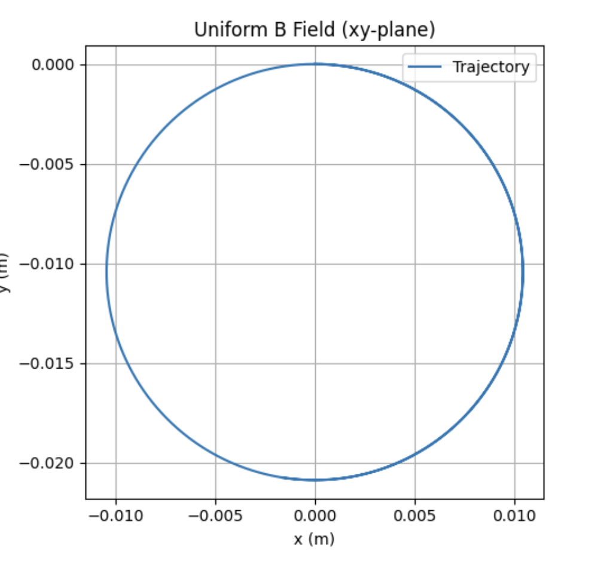
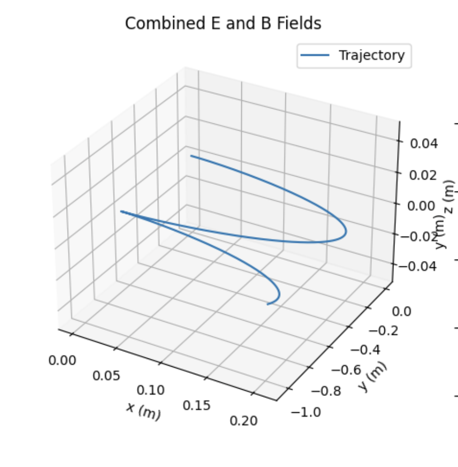
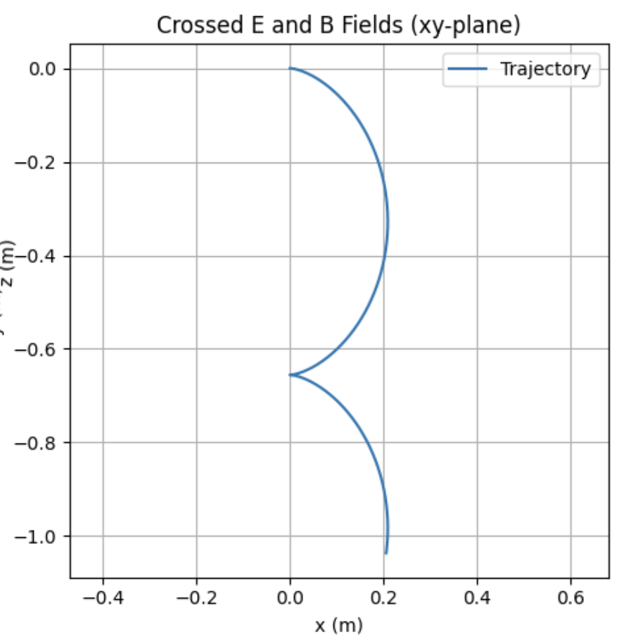

# Problem 1: 
# Simulating the Effects of the Lorentz Force

## Motivation:
The Lorentz force, expressed as \( \mathbf{F} = q\mathbf{E} + q(\mathbf{v} \times \mathbf{B}) \), dictates the motion of charged particles in electric (\( \mathbf{E} \)) and magnetic (\( \mathbf{B} \)) fields. This principle is foundational in plasma physics, particle accelerators, and astrophysics. Simulations allow us to explore its practical applications and visualize the intricate trajectories—such as circular, helical, or drift motions—that emerge. By modeling these effects, we gain insights into how fields control particle behavior in real-world systems, bridging theoretical physics with engineering applications.

## Task:
1. **Exploration of Applications:**
   - Identify systems where the Lorentz force is pivotal (e.g., particle accelerators, mass spectrometers, plasma confinement).
   - Discuss the roles of electric (\( \mathbf{E} \)) and magnetic (\( \mathbf{B} \)) fields in particle motion control.
2. **Simulating Particle Motion:**
   - Implement a simulation to compute and visualize a charged particle’s trajectory under:
     - A uniform magnetic field.
     - Combined uniform electric and magnetic fields.
     - Crossed electric and magnetic fields.
   - Capture circular, helical, or drift motion based on initial conditions and field configurations.
3. **Parameter Exploration:**
   - Vary:
     - Field strengths (\( \mathbf{E} \), \( \mathbf{B} \)).
     - Initial particle velocity (\( \mathbf{v} \)).
     - Charge and mass (\( q \), \( m \)).
   - Observe their influence on the trajectory.
4. **Visualization:**
   - Create labeled 2D and 3D plots of the particle’s path for different scenarios.
   - Highlight phenomena like the Larmor radius and drift velocity.

## Deliverables:
- A Markdown document with a Python script implementing the simulations.
- Visualizations of trajectories for the specified field configurations.
- A discussion linking results to practical systems (e.g., cyclotrons, magnetic traps).
- Suggestions for extending the simulation to complex scenarios, such as non-uniform fields.

## Theory:

### Lorentz Force:
The force on a charged particle is:
\( \mathbf{F} = q\mathbf{E} + q(\mathbf{v} \times \mathbf{B}) \)
Where:
- \( q \): Charge (Coulombs),
- \( \mathbf{E} \): Electric field (N/C),
- \( \mathbf{v} \): Velocity (m/s),
- \( \mathbf{B} \): Magnetic field (Tesla),
- \( m \): Mass (kg).

The acceleration is:
\( \mathbf{a} = \frac{\mathbf{F}}{m} = \frac{q}{m}(\mathbf{E} + \mathbf{v} \times \mathbf{B}) \)

### Key Phenomena:
- **Circular Motion:** In a uniform \( \mathbf{B} \) field (\( \mathbf{E} = 0 \)), the particle moves in a circle perpendicular to \( \mathbf{B} \), with Larmor radius:
  \( r_L = \frac{m v_\perp}{|q| B} \)
- **Helical Motion:** A velocity component parallel to \( \mathbf{B} \) adds a linear motion, forming a helix.
- **Drift Motion:** In crossed \( \mathbf{E} \) and \( \mathbf{B} \) fields, the particle drifts with velocity:
  \( \mathbf{v}_d = \frac{\mathbf{E} \times \mathbf{B}}{B^2} \)

## Exploration of Applications:
1. **Particle Accelerators:** Magnetic fields guide particles in circular paths (e.g., cyclotrons), while electric fields boost their energy.
2. **Mass Spectrometers:** The Lorentz force separates ions by mass-to-charge ratio via trajectory differences in \( \mathbf{B} \) fields.
3. **Plasma Confinement:** Magnetic fields trap charged particles in fusion devices (e.g., tokamaks), preventing escape.

- **Electric Fields (\( \mathbf{E} \)):** Accelerate particles, altering their speed and energy.
- **Magnetic Fields (\( \mathbf{B} \)):** Deflect particles without energy change, controlling their paths.

## Python Implementation:

```python
import numpy as np
import matplotlib.pyplot as plt
from mpl_toolkits.mplot3d import Axes3D

# Constants
q = 1.6e-19  # Charge (C)
m = 1.67e-27 # Mass (kg)
dt = 1e-10   # Smaller time step for better accuracy
steps = 10000

def boris_push(v, E, B):
    """Velocity update using the Boris algorithm"""
    t = (q * B / m) * (dt / 2)
    s = 2 * t / (1 + np.dot(t, t))
    v_minus = v + (q * E / m) * (dt / 2)
    v_prime = v_minus + np.cross(v_minus, t)
    v_plus = v_minus + np.cross(v_prime, s)
    return v_plus + (q * E / m) * (dt / 2)

def simulate_trajectory_boris(E, B, v0, t_max=steps*dt):
    positions = [np.array([0.0, 0.0, 0.0])]
    velocities = [v0]
    t = 0
    while t < t_max:
        v = velocities[-1]
        v_new = boris_push(v, E, B)
        r_new = positions[-1] + v_new * dt
        velocities.append(v_new)
        positions.append(r_new)
        t += dt
    return np.array(positions), np.array(velocities)

# Fields
B_uniform = np.array([0, 0, 0.1])      # Uniform B along z (Tesla)
E_zero = np.array([0, 0, 0])           # No E field
E_uniform = np.array([1e5, 0, 0])      # Uniform E along x (N/C)
E_crossed = np.array([1e5, 0, 0])      # E perpendicular to B
v0 = np.array([1e5, 0, 0])            # Higher initial velocity for visible circle

# Simulations
pos_B, vel_B = simulate_trajectory_boris(E_zero, B_uniform, v0)
pos_EB, vel_EB = simulate_trajectory_boris(E_uniform, B_uniform, v0)
pos_crossed, vel_crossed = simulate_trajectory_boris(E_crossed, B_uniform, v0)

# Visualization
fig = plt.figure(figsize=(15, 5))

# 1. Uniform Magnetic Field (2D)
ax1 = fig.add_subplot(131)
ax1.plot(pos_B[:, 0], pos_B[:, 1], label="Trajectory")
ax1.set_title("Uniform B Field (xy-plane)")
ax1.set_xlabel("x (m)")
ax1.set_ylabel("y (m)")
ax1.legend()
ax1.grid(True)
ax1.axis("equal")

# 2. Combined E and B Fields (3D)
ax2 = fig.add_subplot(132, projection="3d")
ax2.plot(pos_EB[:, 0], pos_EB[:, 1], pos_EB[:, 2], label="Trajectory")
ax2.set_title("Combined E and B Fields")
ax2.set_xlabel("x (m)")
ax2.set_ylabel("y (m)")
ax2.set_zlabel("z (m)")
ax2.legend()

# 3. Crossed Fields (2D)
ax3 = fig.add_subplot(133)
ax3.plot(pos_crossed[:, 0], pos_crossed[:, 1], label="Trajectory")
ax3.set_title("Crossed E and B Fields (xy-plane)")
ax3.set_xlabel("x (m)")
ax3.set_ylabel("y (m)")
ax3.legend()
ax3.grid(True)
ax3.axis("equal")

plt.tight_layout()
plt.show()
```

# Visualizations

## 1. Uniform Magnetic Field 
- **Trajectory:** Circular motion in the xy-plane due to \( \mathbf{B} \) along z.
- **Larmor Radius:** \( r_L = \frac{m v_\perp}{|q| B} \approx 0.0104 \, \text{m} \) (with \( v_\perp = 1e3 \, \text{m/s} \), \( B = 0.1 \, \text{T} \)).
- **Plot:** Circular path in 2D.

- **Explanation:** CA 2D plot in the xy-plane showing circular motion.

## 2. Combined Electric and Magnetic Fields
- **Trajectory:** Helical motion with drift along x due to \( \mathbf{E} \) in the x-direction.
- **Phenomena:** Combines circular motion (from \( \mathbf{B} \)) and acceleration (from \( \mathbf{E} \)).
- **Plot:** 3D helix with x-drift.

- **Explanation:** A 3D plot showing helical motion with drift.

## 3. Crossed Electric and Magnetic Fields
- **Trajectory:** Cycloidal motion with drift in the y-direction (perpendicular to \( \mathbf{E} \) and \( \mathbf{B} \)).
- **Drift Velocity:** \( v_d = \frac{E}{B} = \frac{1e5}{0.1} = 1e6 \, \text{m/s} \).
- **Plot:** 2D xy-plane shows drift and oscillation.

- **Explanation:** A 2D plot in the xy-plane showing cycloidal motion with drift.


# Discussions
- **Cyclotrons:** The uniform \( \mathbf{B} \) case reflects cyclotron motion, where particles orbit at a fixed radius, with \( \mathbf{E} \) fields (not simulated dynamically here) providing acceleration.
- **Magnetic Traps:** Helical paths in combined fields mimic particle confinement in magnetic bottles or tokamaks.
- **Mass Spectrometers:** Crossed fields simulate velocity selectors, filtering particles by \( v_d \).


# Suggestions for Extension
- **Non-Uniform Fields:** Model spatially varying \( \mathbf{E} \) or \( \mathbf{B} \) (e.g., magnetic gradients).
- **Relativistic Effects:** Adjusting for high-speed particles using relativistic dynamics.
- **Multiple Particles:** Simulating interactions for plasma studies.
- **Interactive Plots:** Using Plotly for real-time parameter exploration.