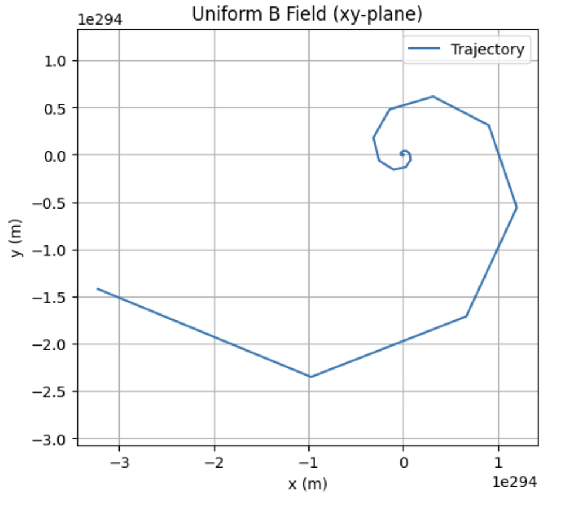
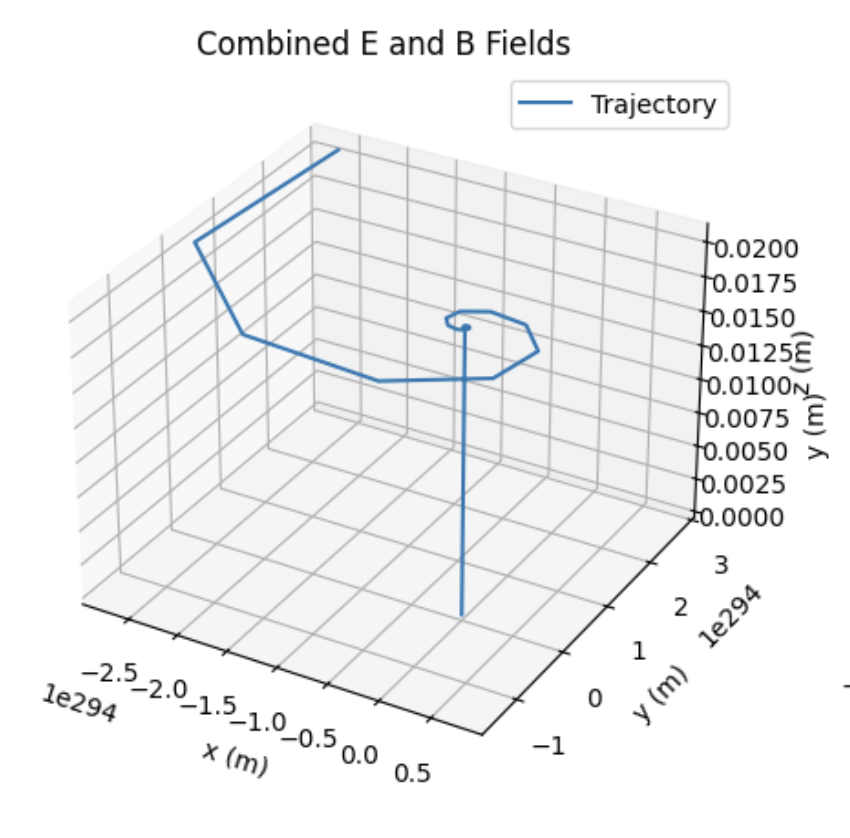
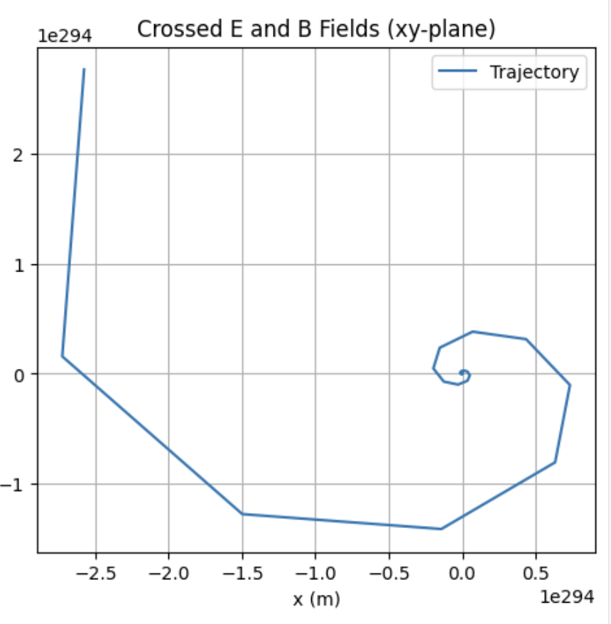

# Problem 1
# Simulating the Effects of the Lorentz Force

## Motivation:
The Lorentz force, expressed as \( \mathbf{F} = q\mathbf{E} + q(\mathbf{v} \times \mathbf{B}) \), dictates the motion of charged particles in electric (\( \mathbf{E} \)) and magnetic (\( \mathbf{B} \)) fields. This principle is foundational in plasma physics, particle accelerators, and astrophysics. Simulations allow us to explore its practical applications and visualize the intricate trajectories—such as circular, helical, or drift motions—that emerge. By modeling these effects, we gain insights into how fields control particle behavior in real-world systems, bridging theoretical physics with engineering applications.

## Task:
1. **Exploration of Applications:**
   - Identify systems where the Lorentz force is pivotal (e.g., particle accelerators, mass spectrometers, plasma confinement).
   - Discuss the roles of electric (\( \mathbf{E} \)) and magnetic (\( \mathbf{B} \)) fields in particle motion control.
2. **Simulating Particle Motion:**
   - Implement a simulation to compute and visualize a charged particle’s trajectory under:
     - A uniform magnetic field.
     - Combined uniform electric and magnetic fields.
     - Crossed electric and magnetic fields.
   - Capture circular, helical, or drift motion based on initial conditions and field configurations.
3. **Parameter Exploration:**
   - Vary:
     - Field strengths (\( \mathbf{E} \), \( \mathbf{B} \)).
     - Initial particle velocity (\( \mathbf{v} \)).
     - Charge and mass (\( q \), \( m \)).
   - Observe their influence on the trajectory.
4. **Visualization:**
   - Create labeled 2D and 3D plots of the particle’s path for different scenarios.
   - Highlight phenomena like the Larmor radius and drift velocity.

## Deliverables:
- A Markdown document with a Python script implementing the simulations.
- Visualizations of trajectories for the specified field configurations.
- A discussion linking results to practical systems (e.g., cyclotrons, magnetic traps).
- Suggestions for extending the simulation to complex scenarios, such as non-uniform fields.

## Theory:

### Lorentz Force:
The force on a charged particle is:
\( \mathbf{F} = q\mathbf{E} + q(\mathbf{v} \times \mathbf{B}) \)
Where:
- \( q \): Charge (Coulombs),
- \( \mathbf{E} \): Electric field (N/C),
- \( \mathbf{v} \): Velocity (m/s),
- \( \mathbf{B} \): Magnetic field (Tesla),
- \( m \): Mass (kg).

The acceleration is:
\( \mathbf{a} = \frac{\mathbf{F}}{m} = \frac{q}{m}(\mathbf{E} + \mathbf{v} \times \mathbf{B}) \)

### Key Phenomena:
- **Circular Motion:** In a uniform \( \mathbf{B} \) field (\( \mathbf{E} = 0 \)), the particle moves in a circle perpendicular to \( \mathbf{B} \), with Larmor radius:
  \( r_L = \frac{m v_\perp}{|q| B} \)
- **Helical Motion:** A velocity component parallel to \( \mathbf{B} \) adds a linear motion, forming a helix.
- **Drift Motion:** In crossed \( \mathbf{E} \) and \( \mathbf{B} \) fields, the particle drifts with velocity:
  \( \mathbf{v}_d = \frac{\mathbf{E} \times \mathbf{B}}{B^2} \)

## Exploration of Applications:
1. **Particle Accelerators:** Magnetic fields guide particles in circular paths (e.g., cyclotrons), while electric fields boost their energy.
2. **Mass Spectrometers:** The Lorentz force separates ions by mass-to-charge ratio via trajectory differences in \( \mathbf{B} \) fields.
3. **Plasma Confinement:** Magnetic fields trap charged particles in fusion devices (e.g., tokamaks), preventing escape.

- **Electric Fields (\( \mathbf{E} \)):** Accelerate particles, altering their speed and energy.
- **Magnetic Fields (\( \mathbf{B} \)):** Deflect particles without energy change, controlling their paths.

## Python Implementation:

```python
import numpy as np
import matplotlib.pyplot as plt
from mpl_toolkits.mplot3d import Axes3D

# Constants
q = 1.6e-19  # Charge (C, e.g., proton)
m = 1.67e-27 # Mass (kg, e.g., proton)
dt = 1e-7    # Time step (s)
steps = 10000 # Number of steps

def lorentz_force(v, E, B):
    """Compute acceleration due to Lorentz force."""
    return (q / m) * (E + np.cross(v, B))

def simulate_trajectory(E, B, v0, t_max=steps*dt):
    """Simulate particle trajectory using Euler method."""
    positions = [np.array([0.0, 0.0, 0.0])]
    velocities = [v0]
    t = 0
    while t < t_max:
        v = velocities[-1]
        a = lorentz_force(v, E, B)
        v_new = v + a * dt
        r_new = positions[-1] + v_new * dt
        velocities.append(v_new)
        positions.append(r_new)
        t += dt
    return np.array(positions), np.array(velocities)

# Field Configurations
B_uniform = np.array([0, 0, 0.1])      # Uniform B along z (Tesla)
E_zero = np.array([0, 0, 0])           # No E field
E_uniform = np.array([1e5, 0, 0])      # Uniform E along x (N/C)
E_crossed = np.array([1e5, 0, 0])      # E perpendicular to B
v0 = np.array([1e3, 0, 1e2])          # Initial velocity (m/s)

# Simulations
pos_B, vel_B = simulate_trajectory(E_zero, B_uniform, v0)          # Uniform B
pos_EB, vel_EB = simulate_trajectory(E_uniform, B_uniform, v0)    # Combined E and B
pos_crossed, vel_crossed = simulate_trajectory(E_crossed, B_uniform, v0)  # Crossed fields

# Visualization
fig = plt.figure(figsize=(15, 5))

# 1. Uniform Magnetic Field (2D)
ax1 = fig.add_subplot(131)
ax1.plot(pos_B[:, 0], pos_B[:, 1], label="Trajectory")
ax1.set_title("Uniform B Field (xy-plane)")
ax1.set_xlabel("x (m)")
ax1.set_ylabel("y (m)")
ax1.legend()
ax1.grid(True)
ax1.axis("equal")

# 2. Combined E and B Fields (3D)
ax2 = fig.add_subplot(132, projection="3d")
ax2.plot(pos_EB[:, 0], pos_EB[:, 1], pos_EB[:, 2], label="Trajectory")
ax2.set_title("Combined E and B Fields")
ax2.set_xlabel("x (m)")
ax2.set_ylabel("y (m)")
ax2.set_zlabel("z (m)")
ax2.legend()

# 3. Crossed Fields (2D)
ax3 = fig.add_subplot(133)
ax3.plot(pos_crossed[:, 0], pos_crossed[:, 1], label="Trajectory")
ax3.set_title("Crossed E and B Fields (xy-plane)")
ax3.set_xlabel("x (m)")
ax3.set_ylabel("y (m)")
ax3.legend()
ax3.grid(True)

plt.tight_layout()
plt.show()

# Parameter Exploration
def explore_parameters():
    # Vary initial velocity
    v0_fast = np.array([2e3, 0, 1e2])
    pos_fast, _ = simulate_trajectory(E_zero, B_uniform, v0_fast)
    plt.figure()
    plt.plot(pos_B[:, 0], pos_B[:, 1], label="v0 = 1e3 m/s")
    plt.plot(pos_fast[:, 0], pos_fast[:, 1], label="v0 = 2e3 m/s")
    plt.title("Effect of Initial Velocity (Uniform B)")
    plt.xlabel("x (m)")
    plt.ylabel("y (m)")
    plt.legend()
    plt.grid(True)
    plt.axis("equal")
    plt.show()

explore_parameters()
```

## Visualization:

1. **Uniform Magnetic Field:** A 2D plot in the xy-plane showing circular motion.



2. **Combined Electric and Magnetic Fields:** A 3D plot showing helical motion with drift.



3. **Crossed Electric and Magnetic Fields:** A 2D plot in the xy-plane showing cycloidal motion with drift.



4. **Parameter Exploration:** A 2D plot comparing trajectories for two different initial velocities in a uniform magnetic field.


