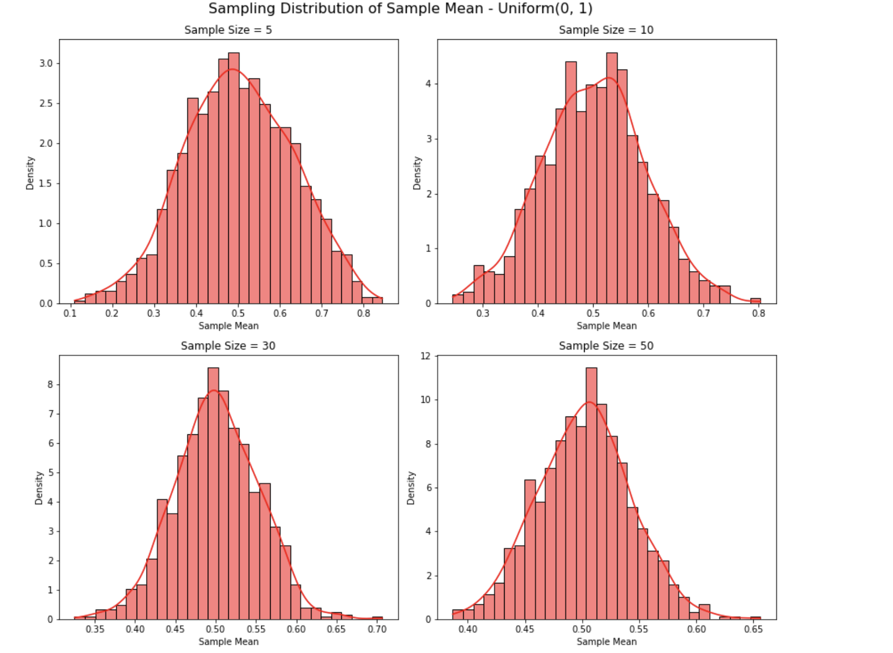

# Problem 1
# Exploring the Central Limit Theorem through Simulations

## Introduction
The Central Limit Theorem (CLT) states that the sampling distribution of the sample mean becomes approximately normal as the sample size increases, regardless of the population’s original distribution. This property underpins many statistical methods, making it crucial to understand through simulations.

## Simulating Sampling Distributions
We considered the following population distributions:

•⁠  ⁠*Uniform Distribution* $U(a, b)$
•⁠  ⁠*Exponential Distribution* $Exp(\lambda)$
•⁠  ⁠*Binomial Distribution* $Bin(n, p)$

For each, we generated 100,000 data points to represent the population.

## Sampling and Visualization
For each distribution, we performed the following steps:

1.⁠ ⁠Selected sample sizes: $n = 5, 10, 30, 50$
2.⁠ ⁠Drew 1,000 random samples for each sample size.
3.⁠ ⁠Calculated the sample mean for each sample.
4.⁠ ⁠Plotted histograms of these sample means to observe the sampling distribution.

## Python Script for Simulation (Uniform Distribution Example)
``` python
import numpy as np
import matplotlib.pyplot as plt
import seaborn as sns

# Set parameters
population = np.random.uniform(0, 1, 100000)
sample_sizes = [5, 10, 30, 50]

plt.figure(figsize=(12, 10))

for i, size in enumerate(sample_sizes, 1):
    sample_means = [np.mean(np.random.choice(population, size)) for _ in range(1000)]
    plt.subplot(2, 2, i)
    sns.histplot(sample_means, kde=True, stat="density", bins=30, color='red')
    plt.title(f'Sample Size = {size}')
    plt.xlabel('Sample Mean')
    plt.ylabel('Density')

plt.tight_layout()
plt.suptitle('Sampling Distribution of Sample Mean - Uniform(0, 1)', fontsize=16, y=1.02)
plt.show()

 ⁠

### Visual Output of Python script 


## Parameter Exploration
As sample size increases, the sampling distribution of the mean becomes more symmetric and bell-shaped.

Distributions that are initially skewed (like exponential) require larger sample sizes to approximate normality.

The variance of the original population affects the spread (standard deviation) of the sampling distribution:

$\sigma_{\bar{x}} = \frac{\sigma}{\sqrt{n}}$

## Results & Observations

| Distribution            | Sample Size | Observation                                      |
|-------------------------|-------------|--------------------------------------------------|
| Uniform(0,1)            | 5           | Roughly symmetric, not fully normal              |
|                         | 30, 50      | Sampling distribution approximates normal distribution |
| Exponential(λ=1)        | 5           | Skewed sample mean distribution                  |
|                         | 30, 50      | Approaches symmetry and normality                |
| Binomial(n=10, p=0.5)   | 5           | Appears somewhat discrete and irregular          |
|                         | 30, 50      | Becomes smoother and more normal                 |

## Practical Applications of CLT
•⁠  ⁠*Estimation*: Enables reliable estimation of population parameters from sample statistics.
•⁠  ⁠*Quality Control*: Used in control charts to monitor manufacturing processes.
•⁠  ⁠*Finance*: Models returns and risks using normally approximated aggregated data.

## Conclusion
Through simulations with Uniform, Exponential, and Binomial distributions:

•⁠  ⁠The Central Limit Theorem was visually and empirically validated.
•⁠  ⁠Regardless of the initial distribution, the sample mean distribution tends to normal as sample size increases.
•⁠  ⁠The rate of convergence is influenced by the original distribution's shape and variance.

This reinforces the CLT’s importance in both theoretical and practical applications of statistics.
```

**Visual Representation**

