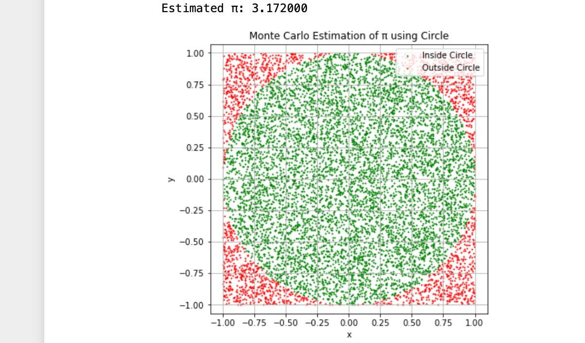
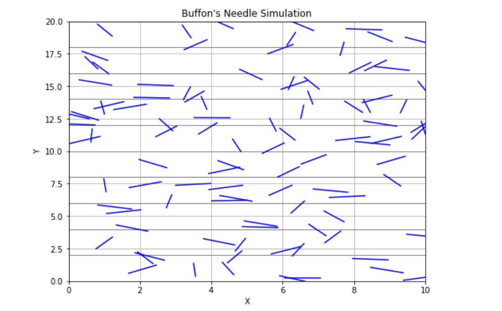

# Problem 2
# Estimating Pi using Monte Carlo Methods

## Introduction

Monte Carlo methods use *random sampling* to obtain numerical results. In this problem, we explore two classical Monte Carlo approaches to estimate the value of \( \pi \):

•⁠  ⁠*Circle-based method* using geometric probability.
•⁠  ⁠*Buffon’s Needle* problem using probabilistic geometry.

These simulations highlight the power of randomness in estimating mathematical constants and provide insight into convergence and computational efficiency.

---

## Part 1: Estimating \( \pi \) Using a Circle

### 1. Theoretical Foundation

Consider a unit circle (radius = 1) inscribed within a square of side length 2 (from -1 to 1). The *area of the circle* is:

\[
A_{\text{circle}} = \pi r^2 = \pi
\]

The *area of the square* is:

\[
A_{\text{square}} = 2 \times 2 = 4
\]

If we generate random points \((x, y)\) within the square, the probability that a point falls inside the circle is:

\[
P = \frac{\text{Area of Circle}}{\text{Area of Square}} = \frac{\pi}{4}
\]

So,

\[
\pi \approx 4 \times \frac{\text{Points Inside Circle}}{\text{Total Points}}
\]

---

### 2. Simulation Script (Circle-Based)
```python
import numpy as np
import matplotlib.pyplot as plt

def estimate_pi(num_points=10000):
    x = np.random.uniform(-1, 1, num_points)
    y = np.random.uniform(-1, 1, num_points)
    inside_circle = x**2 + y**2 <= 1
    pi_estimate = 4 * np.sum(inside_circle) / num_points
    return pi_estimate, x, y, inside_circle

# Example with 10,000 points
pi_val, x, y, inside = estimate_pi(10000)
print(f"Estimated π: {pi_val:.6f}")
plt.figure(figsize=(6, 6))
plt.scatter(x[inside], y[inside], color='green', s=1, label='Inside Circle')
plt.scatter(x[~inside], y[~inside], color='red', s=1, label='Outside Circle')
plt.title('Monte Carlo Estimation of π using Circle')
plt.xlabel('x')
plt.ylabel('y')
plt.legend()
plt.axis('equal')
plt.grid(True)
plt.show()
```
## Output of Python script 


# Part 2: Estimating $\pi$ Using Buffon’s Needle

## 1. Theoretical Foundation
Buffon’s Needle problem estimates $\pi$ by dropping a needle of length $L$ on a plane with parallel lines spaced a distance $D$ apart. If $L \leq D$, the probability that the needle crosses a line is:

$P = \frac{2L}{\pi D}$

Solving for $\pi$:

$\pi \approx \frac{2L \times \text{Number of Throws}}{D \times \text{Number of Crossings}}$

## 2. Simulation Code (Buffon’s Needle)
```python
import numpy as np

def buffon_needle(num_drops=10000, needle_length=1.0, line_distance=2.0):
    if needle_length > line_distance:
        raise ValueError("Needle length must be less than or equal to the distance between lines.")

    crossings = 0

    for _ in range(num_drops):
        center = np.random.uniform(0, line_distance / 2)
        angle = np.random.uniform(0, np.pi / 2)
        if center <= (needle_length / 2) * np.sin(angle):
            crossings += 1

    if crossings == 0:
        return None  # Avoid division by zero
    pi_estimate = (2 * needle_length * num_drops) / (line_distance * crossings)
    return pi_estimate

# Example usage:
estimated_pi = buffon_needle(10000)
print(f"Estimated π using Buffon's Needle: {estimated_pi:.6f}")
 
 ## Estimated π using Buffon's Needle: 3.159558
```
## 3. Visualization
```python
import matplotlib.patches as patches

def plot_buffon(needle_length=1.0, line_distance=2.0, num_needles=100):
    fig, ax = plt.subplots(figsize=(8, 5))
    # Draw lines
    for i in range(0, 10):
        ax.axhline(i * line_distance, color='gray', linewidth=1)
    # Draw needles
    for _ in range(num_needles):
        y_center = np.random.uniform(0, 10 * line_distance)
        angle = np.random.uniform(0, np.pi)
        y1 = y_center + (needle_length / 2) * np.sin(angle)
        y2 = y_center - (needle_length / 2) * np.sin(angle)
        x1 = 5 + (needle_length / 2) * np.cos(angle)
        x2 = 5 - (needle_length / 2) * np.cos(angle)
        ax.plot([x1, x2], [y1, y2], 'b')
    ax.set_xlim(4, 6)
    ax.set_ylim(0, 10 * line_distance)
    ax.set_title("Buffon's Needle Simulation")
    plt.show()
```
## Output of Python script 

 ⁠
## 4. Analysis and Comparison

| Method          | Estimated π (10,000 samples) | Convergence Speed | Computational Cost |
|-----------------|-----------------------------|-------------------|--------------------|
| Circle-based    | ~3.14                       | Fast              | Low                |
| Buffon’s Needle | Varies, slower convergence  | Slow              | Moderate           |

The circle-based method converges faster and is computationally efficient. Buffon’s Needle method, while elegant and historical, generally requires many more samples to achieve the same level of accuracy.

## Conclusion
Both methods successfully estimate $\pi$ using random sampling.

Monte Carlo simulations demonstrate how randomness can provide approximations of complex constants.

The circle-based method is preferable in practice due to its simplicity and efficiency.

Buffon’s Needle is a powerful illustration of the intersection between geometry and probability.