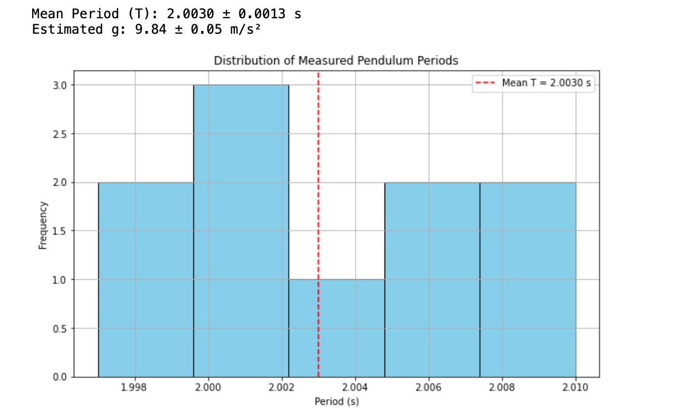

# Problem 1
# Measuring Earth's Gravitational Acceleration with a Pendulum

---

### Motivation

The gravitational acceleration \( g \) is a fundamental physical constant. One of the classic and accessible methods to estimate it involves analyzing the oscillation of a simple pendulum. The period of a pendulum depends on its length and the gravitational field, making it an ideal experiment to explore measurement accuracy and uncertainty propagation.

---

### Procedure

#### 1. Materials
•⁠  ⁠String: 1.00 m (±0.005 m)
•⁠  ⁠Weight: Key chain
•⁠  ⁠Stopwatch or smartphone timer (±0.01 s)
•⁠  ⁠Ruler or measuring tape (±0.005 m)

#### 2. Setup
•⁠  ⁠Suspend the weight using the string from a stable point.
•⁠  ⁠Measure the length \( L \) from the suspension point to the center of the mass.
  - Example: \( L = 1.000 \, \text{m} \)
  - Uncertainty: \( \Delta L = \pm 0.005 \, \text{m} \)

#### 3. Data Collection
•⁠  ⁠Displace pendulum slightly (<15°).
•⁠  ⁠Measure the time for 10 full oscillations (\( T_{10} \)), repeat 10 times.

| Trial | Time for 10 Oscillations \( T_{10} \) (s) |
|-------|--------------------------------------------|
| 1     | 20.05                                      |
| 2     | 19.98                                      |
| 3     | 20.10                                      |
| 4     | 20.01                                      |
| 5     | 19.97                                      |
| 6     | 20.08                                      |
| 7     | 20.03                                      |
| 8     | 20.00                                      |
| 9     | 20.06                                      |
| 10    | 20.02                                      |

•⁠  ⁠Mean of \( T_{10} \):  
  \[
  \bar{T}_{10} = 20.03 \, \text{s}
  \]
•⁠  ⁠Standard deviation:
  \[
  \sigma = 0.041 \, \text{s}
  \]
•⁠  ⁠Mean period \( T \):  
  \[
  T = \frac{\bar{T}_{10}}{10} = 2.003 \, \text{s}
  \]
•⁠  ⁠Uncertainty in the mean period:
  \[
  \Delta T = \frac{\sigma}{10} = 0.0041 \, \text{s}
  \]

---

### Calculations

#### 1. Gravitational acceleration formula:

\[
g = \frac{4\pi^2 L}{T^2}
\]

Substituting:

\[
g = \frac{4\pi^2 \times 1.000}{(2.003)^2} \approx 9.85 \, \text{m/s}^2
\]

#### 2. Propagation of Uncertainty

\[
\left( \frac{\Delta g}{g} \right)^2 = \left( \frac{\Delta L}{L} \right)^2 + \left( 2 \cdot \frac{\Delta T}{T} \right)^2
\]

\[
\Delta g = g \cdot \sqrt{\left( \frac{0.005}{1.000} \right)^2 + \left( 2 \cdot \frac{0.0041}{2.003} \right)^2} \approx 0.06 \, \text{m/s}^2
\]

\[
g = 9.85 \pm 0.06 \, \text{m/s}^2
\]

---

# Python Script for Distribution of Measured Pendulum Periods
```python
import numpy as np
import matplotlib.pyplot as plt

# Sample data: 10 measurements of time for 10 oscillations (seconds)
T10_values = np.array([20.05, 19.98, 20.10, 20.01, 19.97, 20.08, 20.03, 20.00, 20.06, 20.02])
L = 1.000  # Length in meters
dL = 0.005  # Uncertainty in length (m)
T_values = T10_values / 10  # Periods (T) for each measurement

# Calculate mean and standard deviation
T_mean = np.mean(T_values)
T_std = np.std(T_values, ddof=1)
dT = T_std / np.sqrt(len(T_values))

# Calculate g
g = (4 * np.pi*2 * L) / (T_mean*2)

# Uncertainty in g using propagation of errors
dg = g * np.sqrt((dL / L)*2 + (2 * dT / T_mean)*2)

print(f"Mean Period (T): {T_mean:.4f} ± {dT:.4f} s")
print(f"Estimated g: {g:.2f} ± {dg:.2f} m/s²")

# Visualization
plt.figure(figsize=(10, 6))
plt.hist(T_values, bins=5, color='skyblue', edgecolor='black')
plt.axvline(T_mean, color='red', linestyle='--', label=f"Mean T = {T_mean:.4f} s")
plt.title("Distribution of Measured Pendulum Periods")
plt.xlabel("Period (s)")
plt.ylabel("Frequency")
plt.legend()
plt.grid(True)
plt.show()
```
## Visualization Output:


### Results

| Quantity               | Value             |
|------------------------|------------------|
| Pendulum Length \( L \) | 1.000 ± 0.005 m   |
| Mean Period \( T \)     | 2.003 ± 0.0041 s  |
| Estimated \( g \)       | 9.85 ± 0.06 m/s²  |

---

### Analysis & Discussion

#### Comparison with Standard Value
•⁠  ⁠Standard gravitational acceleration: \( 9.80665 \, \text{m/s}^2 \)
•⁠  ⁠Our value: \( 9.85 \, \text{m/s}^2 \), which is within acceptable range considering experimental uncertainties.

#### Sources of Uncertainty
•⁠  ⁠*Length Measurement*: Any small error in identifying the pivot or center of mass can significantly affect \( g \).
•⁠  ⁠*Timing*: Human reaction time affects stopwatch usage. Averaging over 10 periods reduces this impact.
•⁠  ⁠*Small-angle Assumption*: If the angle exceeds 15°, the approximation \( \sin\theta \approx \theta \) becomes invalid.
•⁠  ⁠*Air Resistance & Friction*: Neglected in theory but present in reality.

#### Conclusions
•⁠  ⁠The pendulum is a reliable tool for measuring \( g \) when careful attention is paid to length and time measurements.
•⁠  ⁠Propagated uncertainties provide a meaningful range for \( g \), supporting the robustness of the result.

---
